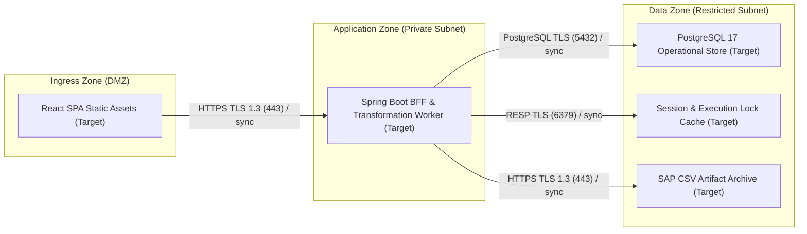

# Platform Network Topology

## Target topology

```mermaid
flowchart LR
  subgraph dmz["Ingress Zone (DMZ)"]
    spa["React SPA Static Assets (Target)"]
  end
  subgraph appzone["Application Zone (Private Subnet)"]
    bff["Spring Boot BFF & Transformation Worker (Target)"]
  end
  subgraph datazone["Data Zone (Restricted Subnet)"]
    pg["PostgreSQL 17 Operational Store (Target)"]
    redis["Session & Execution Lock Cache (Target)"]
    bucket["SAP CSV Artifact Archive (Target)"]
  end

  spa -->|"HTTPS TLS 1.3 (443) / sync"| bff
  bff -->|"PostgreSQL TLS (5432) / sync"| pg
  bff -->|"RESP TLS (6379) / sync"| redis
  bff -->|"HTTPS TLS 1.3 (443) / sync"| bucket
```
